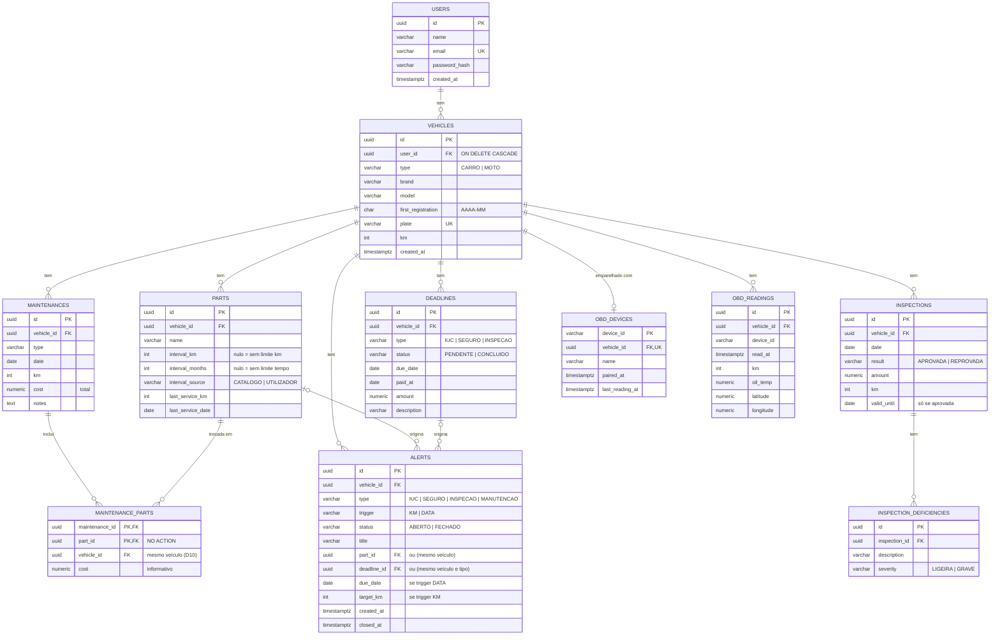

# Diagrama ER (v3)

Todas as tabelas estão no schema `public` da base `carmotocare`. `users` é da SAPI Utilizadores; as restantes
são da SAPI Veículos. Ver [data-model.md](data-model.md), D3.

```mermaid
erDiagram
    USERS {
        uuid id PK
        varchar name
        varchar email UK
        varchar password_hash
        timestamptz created_at
    }
    VEHICLES {
        uuid id PK
        uuid user_id FK "ON DELETE CASCADE"
        varchar type "CARRO | MOTO"
        varchar brand
        varchar model
        char first_registration "AAAA-MM"
        varchar plate UK
        int km
        timestamptz created_at
    }
    PARTS {
        uuid id PK
        uuid vehicle_id FK
        varchar name
        int interval_km "nulo = sem limite km"
        int interval_months "nulo = sem limite tempo"
        varchar interval_source "CATALOGO | UTILIZADOR"
        int last_service_km
        date last_service_date
    }
    DEADLINES {
        uuid id PK
        uuid vehicle_id FK
        varchar type "IUC | SEGURO | INSPECAO"
        varchar status "PENDENTE | CONCLUIDO"
        date due_date
        date paid_at
        numeric amount
        varchar description
    }
    MAINTENANCES {
        uuid id PK
        uuid vehicle_id FK
        varchar type
        date date
        int km
        numeric cost "total"
        text notes
    }
    MAINTENANCE_PARTS {
        uuid maintenance_id PK,FK
        uuid part_id PK,FK "NO ACTION"
        uuid vehicle_id FK "mesmo veículo (D10)"
        numeric cost "informativo"
    }
    INSPECTIONS {
        uuid id PK
        uuid vehicle_id FK
        date date
        varchar result "APROVADA | REPROVADA"
        numeric amount
        int km
        date valid_until "só se aprovada"
    }
    INSPECTION_DEFICIENCIES {
        uuid id PK
        uuid inspection_id FK
        varchar description
        varchar severity "LIGEIRA | GRAVE"
    }
    ALERTS {
        uuid id PK
        uuid vehicle_id FK
        varchar type "IUC | SEGURO | INSPECAO | MANUTENCAO"
        varchar trigger "KM | DATA"
        varchar status "ABERTO | FECHADO"
        varchar title
        uuid part_id FK "ou (mesmo veículo)"
        uuid deadline_id FK "ou (mesmo veículo e tipo)"
        date due_date "se trigger DATA"
        int target_km "se trigger KM"
        timestamptz created_at
        timestamptz closed_at
    }
    OBD_DEVICES {
        varchar device_id PK
        uuid vehicle_id FK,UK
        varchar name
        timestamptz paired_at
        timestamptz last_reading_at
    }
    OBD_READINGS {
        uuid id PK
        uuid vehicle_id FK
        varchar device_id
        timestamptz read_at
        int km
        numeric oil_temp
        numeric latitude
        numeric longitude
    }

    USERS ||--o{ VEHICLES : tem
    VEHICLES ||--o{ PARTS : tem
    VEHICLES ||--o{ DEADLINES : tem
    VEHICLES ||--o{ MAINTENANCES : tem
    VEHICLES ||--o{ INSPECTIONS : tem
    VEHICLES ||--o{ ALERTS : tem
    VEHICLES ||--o| OBD_DEVICES : "emparelhado com"
    VEHICLES ||--o{ OBD_READINGS : tem
    MAINTENANCES ||--o{ MAINTENANCE_PARTS : inclui
    PARTS ||--o{ MAINTENANCE_PARTS : "trocada em"
    INSPECTIONS ||--o{ INSPECTION_DEFICIENCIES : tem
    PARTS |o--o{ ALERTS : origina
    DEADLINES |o--o{ ALERTS : origina
```
